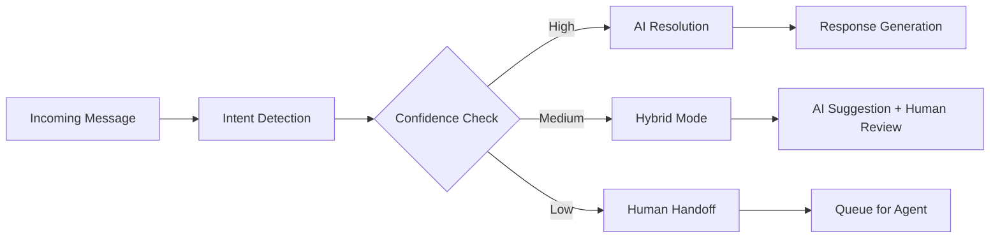

# Crove AI Assistant Architecture

## Overview
Crove AI Assistant is an advanced customer support automation system inspired by leading platforms like Ada AI and Tidio Lyro, designed to provide intelligent, contextual, and efficient customer service.

## Core Design Principles

### 1. AI-First Architecture
- **Primary Goal**: Maximize autonomous resolution rate (target: 70-80%)
- **Human-in-the-Loop**: Seamless handoff when AI confidence is low
- **Continuous Learning**: Learn from human agent resolutions

### 2. Multi-Model Approach
```
┌─────────────────────────────────────────────────┐
│            Crove AI Assistant Core              │
├─────────────────────────────────────────────────┤
│  ┌──────────────┐  ┌──────────────┐           │
│  │ Intent       │  │ Reasoning    │           │
│  │ Classifier   │  │ Engine       │           │
│  └──────────────┘  └──────────────┘           │
│                                                 │
│  ┌──────────────┐  ┌──────────────┐           │
│  │ Context      │  │ Response     │           │
│  │ Manager      │  │ Generator    │           │
│  └──────────────┘  └──────────────┘           │
└─────────────────────────────────────────────────┘
```

## System Architecture

### Layer 1: Channel Integration
```yaml
channels:
  - website_widget
  - telegram_bot (@Crove_bot)
  - whatsapp_business
  - email
  - api_webhooks
```

### Layer 2: Conversation Pipeline


### Layer 3: Intelligence Components

#### 3.1 Reasoning Engine (Inspired by Ada AI)
```ruby
class ReasoningEngine
  # Multi-step problem solving
  def analyze_query(message)
    steps = []
    
    # Step 1: Extract entities and intent
    entities = extract_entities(message)
    intent = classify_intent(message, entities)
    
    # Step 2: Retrieve relevant context
    context = gather_context(
      conversation_history: conversation.messages,
      customer_data: customer.attributes,
      knowledge_base: search_knowledge(message)
    )
    
    # Step 3: Generate resolution plan
    plan = create_resolution_plan(intent, entities, context)
    
    # Step 4: Execute plan steps
    plan.steps.each do |step|
      result = execute_step(step)
      steps << result
      break if result.requires_human?
    end
    
    { steps: steps, confidence: calculate_confidence(steps) }
  end
end
```

#### 3.2 Knowledge Management System
```ruby
class KnowledgeBase
  # RAG (Retrieval-Augmented Generation) implementation
  
  def components
    {
      vector_store: 'pgvector',        # Embeddings storage
      embedding_model: 'text-embedding-3-small',
      retrieval_method: 'hybrid',      # Keyword + Semantic
      reranking: true,                 # Improve relevance
      sources: [
        'help_articles',
        'past_resolutions',
        'product_docs',
        'api_documentation',
        'faq_responses'
      ]
    }
  end
  
  def search(query, limit: 5)
    # Hybrid search: semantic + keyword
    semantic_results = vector_search(query, limit: limit * 2)
    keyword_results = full_text_search(query, limit: limit * 2)
    
    # Merge and rerank
    combined = merge_results(semantic_results, keyword_results)
    rerank(combined, query, limit: limit)
  end
end
```

#### 3.3 Response Generation
```ruby
class ResponseGenerator
  def generate(intent, context, style: :professional)
    prompt = build_prompt(
      intent: intent,
      context: context,
      style: style,
      guidelines: load_brand_guidelines,
      guardrails: safety_rules
    )
    
    response = llm.generate(
      prompt: prompt,
      model: select_model(intent.complexity),
      temperature: intent.creative? ? 0.7 : 0.3,
      max_tokens: 500
    )
    
    # Post-processing
    response = apply_safety_filters(response)
    response = inject_personalization(response, context.customer)
    response = add_action_buttons(response, intent.next_actions)
    
    response
  end
  
  private
  
  def select_model(complexity)
    case complexity
    when :high
      'gpt-4-turbo'      # Complex reasoning
    when :medium
      'gpt-3.5-turbo'    # Standard queries
    when :low
      'local-llm'        # Simple responses (faster, cheaper)
    end
  end
end
```

### Layer 4: Analytics & Learning

#### 4.1 Performance Metrics
```yaml
metrics:
  resolution_rate: "% of conversations resolved without human"
  average_resolution_time: "Time to resolve"
  customer_satisfaction: "CSAT score"
  deflection_rate: "% avoided human contact"
  confidence_accuracy: "Correlation between confidence and success"
  handoff_rate: "% requiring human intervention"
  first_contact_resolution: "% resolved in first interaction"
```

#### 4.2 Continuous Improvement
```ruby
class LearningEngine
  def learn_from_resolution(conversation)
    if conversation.human_resolved?
      # Extract patterns from human resolution
      pattern = extract_resolution_pattern(conversation)
      
      # Update knowledge base
      add_to_knowledge_base(pattern) if pattern.quality_score > 0.8
      
      # Fine-tune intent classifier
      update_intent_classifier(
        input: conversation.initial_message,
        correct_intent: conversation.resolved_intent
      )
      
      # Update confidence thresholds
      adjust_confidence_thresholds(conversation)
    end
  end
end
```

## Database Schema

### Core Tables
```sql
-- AI Assistants (similar to Captain's assistants)
CREATE TABLE ai_assistants (
  id SERIAL PRIMARY KEY,
  account_id INTEGER REFERENCES accounts(id),
  name VARCHAR(100),
  description TEXT,
  model_config JSONB, -- LLM settings
  personality JSONB,  -- Tone, style, guidelines
  capabilities JSONB, -- What it can/cannot do
  active BOOLEAN DEFAULT true,
  created_at TIMESTAMP,
  updated_at TIMESTAMP
);

-- Knowledge Base Items
CREATE TABLE knowledge_items (
  id SERIAL PRIMARY KEY,
  account_id INTEGER REFERENCES accounts(id),
  assistant_id INTEGER REFERENCES ai_assistants(id),
  title VARCHAR(255),
  content TEXT,
  metadata JSONB,
  embedding vector(1536), -- For semantic search
  source_type VARCHAR(50), -- 'article', 'faq', 'resolution', 'document'
  source_id INTEGER,
  created_at TIMESTAMP,
  updated_at TIMESTAMP
);

-- AI Conversations
CREATE TABLE ai_conversations (
  id SERIAL PRIMARY KEY,
  conversation_id INTEGER REFERENCES conversations(id),
  assistant_id INTEGER REFERENCES ai_assistants(id),
  status VARCHAR(50), -- 'active', 'resolved', 'escalated'
  confidence_score DECIMAL(3,2),
  resolution_type VARCHAR(50), -- 'autonomous', 'hybrid', 'escalated'
  resolution_time INTEGER, -- seconds
  metadata JSONB,
  created_at TIMESTAMP,
  updated_at TIMESTAMP
);

-- Reasoning Steps (for explainability)
CREATE TABLE reasoning_steps (
  id SERIAL PRIMARY KEY,
  ai_conversation_id INTEGER REFERENCES ai_conversations(id),
  step_number INTEGER,
  step_type VARCHAR(50), -- 'intent', 'retrieval', 'generation'
  input JSONB,
  output JSONB,
  confidence DECIMAL(3,2),
  duration_ms INTEGER,
  created_at TIMESTAMP
);

-- Learning Data
CREATE TABLE learning_feedback (
  id SERIAL PRIMARY KEY,
  ai_conversation_id INTEGER REFERENCES ai_conversations(id),
  feedback_type VARCHAR(50), -- 'helpful', 'not_helpful', 'incorrect'
  agent_correction TEXT,
  customer_rating INTEGER,
  metadata JSONB,
  created_at TIMESTAMP
);
```

## Implementation Phases

### Phase 1: Foundation (Week 1-2)
- [ ] Set up database schema
- [ ] Implement basic RAG with pgvector
- [ ] Create simple intent classifier
- [ ] Build response generator with OpenAI/Claude API
- [ ] Basic conversation flow

### Phase 2: Intelligence (Week 3-4)
- [ ] Implement Reasoning Engine
- [ ] Add multi-model support (GPT-4, Claude, local LLM)
- [ ] Build confidence scoring system
- [ ] Implement human handoff logic
- [ ] Create knowledge base management UI

### Phase 3: Optimization (Week 5-6)
- [ ] Add hybrid search (semantic + keyword)
- [ ] Implement response caching
- [ ] Build analytics dashboard
- [ ] Add A/B testing framework
- [ ] Optimize for speed and cost

### Phase 4: Advanced Features (Week 7-8)
- [ ] Multi-turn conversation planning
- [ ] Proactive assistance
- [ ] Voice support
- [ ] Multi-language support
- [ ] Custom workflows/automations

## Key Differentiators

### 1. Transparent Reasoning
Unlike black-box systems, Crove shows its reasoning steps, building trust with both agents and customers.

### 2. Hybrid Intelligence
Seamlessly blends AI and human intelligence, with AI learning from every human resolution.

### 3. Cost-Optimized
Multi-model approach uses expensive models only when needed, keeping costs low (~$0.10-0.30 per conversation).

### 4. Privacy-First
- On-premise deployment option
- Data residency compliance
- No training on customer data without explicit consent

### 5. Developer-Friendly
- RESTful API
- Webhooks for events
- SDKs for major languages
- Extensive documentation

## Integration Points

### With Existing Chatwoot
```ruby
# Extend existing conversation model
class Conversation < ApplicationRecord
  has_one :ai_conversation
  
  def ai_enabled?
    account.feature_enabled?('ai_assistant') && 
    inbox.ai_assistant.present? &&
    !contact.opted_out_of_ai?
  end
  
  def process_with_ai
    return unless ai_enabled?
    
    ai_service = AIService.new(self)
    result = ai_service.process_message(messages.last)
    
    if result.confident?
      create_ai_response(result.response)
    elsif result.needs_human?
      escalate_to_human(result.reason)
    else
      create_ai_suggestion(result.suggestion)
    end
  end
end
```

## Success Metrics

### Target KPIs (6 months)
- **Resolution Rate**: 70% autonomous resolution
- **Response Time**: <2 seconds for 95% of queries
- **CSAT**: >4.5/5.0 for AI interactions
- **Cost per Resolution**: <$0.30
- **Handoff Rate**: <30%
- **False Positive Rate**: <5% (wrong answers)

## Security & Compliance

### Security Measures
- End-to-end encryption for sensitive data
- Rate limiting and DDoS protection
- Regular security audits
- PII detection and masking
- Audit logs for all AI decisions

### Compliance
- GDPR compliant (right to explanation)
- SOC 2 Type II certification path
- HIPAA ready architecture
- CCPA compliant

## Conclusion

Crove AI Assistant combines the best practices from industry leaders while maintaining the flexibility and openness that makes Chatwoot powerful. By focusing on transparency, cost-efficiency, and continuous learning, we can build an AI system that truly augments human agents rather than replacing them.