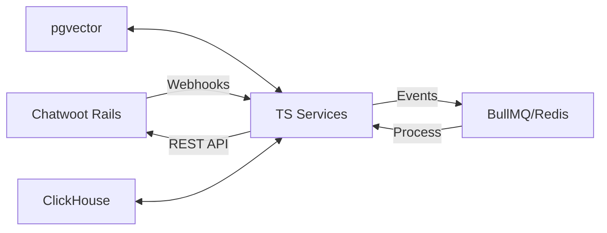

## Mục tiêu

Tài liệu này tổng hợp tính năng Enterprise (EE) của Chatwoot ở mức hành vi và luồng hoạt động, để “inspired-by” và tự triển khai lại theo clean-room, không sao chép mã trong `enterprise/`. Áp dụng cho triển khai SaaS không dùng licensing theo seat.

## Phạm vi và nguyên tắc clean-room
- Không đọc/copy mã từ thư mục `enterprise/` khi viết code. Chỉ dùng mô tả hành vi, giao diện, tên tính năng ở mức khái niệm.
- Viết mới hoàn toàn backend, DB, service và API tương thích tối thiểu với UI.
- Tách flag bật/tắt tính năng về hệ thống feature flags riêng của sản phẩm (không phụ thuộc `INSTALLATION_PRICING_PLAN`).

## Danh sách tính năng EE và hành vi

### 1) Captain/Copilot (AI Assistants)
- UI: các route quản trị assistants, documents, responses, scenarios.
- Hành vi chính:
  1. Tạo Assistant (tên, mô tả, thông số inference).
  2. Đính kèm Documents (nguồn kiến thức) và Tools (khả năng hành động).
  3. Trong cuộc hội thoại, gọi Assistant để sinh trả lời hoặc hành động.
- Paywall cũ kiểm tra `isEnterprise` và `enterprisePlanName`. Với clean-room, bỏ điều kiện plan, thay bằng feature flag của account.

### 2) SLA và SLA Reports
- Cho phép tạo chính sách SLA (mốc thời gian đáp ứng/giải quyết), áp dụng vào cuộc hội thoại.
- Ghi nhận sự kiện vi phạm, tổng hợp báo cáo (tổng miss, tỷ lệ, thời lượng, theo thời gian/nhãn/inbox/agent).

### 3) Audit Logs
- Ghi nhật ký thay đổi các thực thể quan trọng (Account, Team, Agent, Automation, Inbox, Conversation...).
- Cung cấp giao diện lọc/phan trang, tải dữ liệu.

### 4) Custom Roles
- Cho phép định nghĩa role tuỳ chỉnh và gán permissions cho user trong phạm vi account.

### 5) Disable Branding
- Cho phép ẩn branding “Chatwoot/Installation name” trên widget/portal/email.

### 6) Help Center
- CMS nhẹ cho Portals/Categories/Articles; render cổng thông tin công khai.

## Thiết kế clean-room đề xuất

### A. Feature flags riêng (✅ Completed)
- Service: `Crove::FeatureService` sử dụng Featurable concern có sẵn
- API: `/api/v1/accounts/:id/crove_features` với enable/disable endpoints
- 7 features đã config trong `config/features.yml`

### B. Chatwoot EE Architecture (Tham khảo)

Chatwoot tách EE features thành 2 tiers:

**Tier 1: Frontend (có thể open source)**
```
app/javascript/dashboard/
├── api/captain/           # API clients
├── store/captain/         # Vuex stores
├── routes/dashboard/captain/  # UI components
└── components-next/captain/   # Vue components
```

**Tier 2: Backend (Licensed)**  
```
enterprise/
├── app/models/captain/        # Data models
├── app/controllers/.../captain/  # API endpoints
├── app/services/captain/      # Business logic
└── app/jobs/captain/         # Background jobs
```

### C. Crove Clean-room Pattern
Áp dụng 2-tier nhưng tách biệt hoàn toàn khỏi `/enterprise`:

**Frontend (Dashboard)**
```
app/javascript/dashboard/
├── api/crove-ai/              # API clients (call Crove backend)
├── store/crove-ai/            # UI state management
├── routes/dashboard/crove-ai/ # UI routes & components
└── components-next/crove-ai/  # Vue 3 components
```

**Backend (Clean-room)**
```
app/
├── models/crove/              # Clean-room models
├── controllers/api/v1/accounts/crove_*_controller.rb
├── services/crove/            # Clean-room services  
└── jobs/crove/               # Background processing
```

**Tại sao tách như vậy?**
- Tránh vi phạm license của `/enterprise`
- Frontend có thể open-source sau này
- Backend hoàn toàn clean-room implementation

### D. AI Assistants Implementation (Thay Captain)

**Frontend (theo pattern Chatwoot)**
```
app/javascript/dashboard/
├── api/crove-ai/              # API clients (tương tự api/captain/)
│   ├── assistants.ts          # Call Crove clean-room APIs
│   └── knowledge-base.ts
├── store/crove-ai/            # Vuex stores (tương tự store/captain/)
│   ├── assistants.js
│   └── knowledge-base.js
├── routes/dashboard/crove-ai/ # Routes (tương tự captain.routes.js)
│   ├── assistants/
│   └── crove-ai.routes.js
└── components-next/crove-ai/  # Vue components
    ├── ChatInterface.vue
    └── KnowledgeBaseSync.vue
```

**Backend (Clean-room, KHÔNG dùng enterprise/)**
```
app/
├── models/crove/
│   ├── assistant.rb           # Thay enterprise/app/models/captain/
│   ├── knowledge_base.rb
│   └── document.rb
├── controllers/api/v1/accounts/
│   └── crove_assistants_controller.rb  # Thay captain/assistants_controller.rb
├── services/crove/
│   ├── openai_service.rb      # Thay captain/llm/assistant_chat_service.rb
│   └── embedding_service.rb
└── jobs/crove/
    └── generate_embeddings_job.rb
```

**API Endpoints (Clean-room)**
- GET/POST `/api/v1/accounts/:id/crove/assistants`
- POST `/api/v1/accounts/:id/crove/assistants/:id/generate`
- GET/POST `/api/v1/accounts/:id/crove/knowledge-bases`

### C. SLA module
- Bảng:
  - `sla_policies` (account_id, name, targets:jsonb, rules:jsonb).
  - `applied_slas` (conversation_id, sla_policy_id, started_at, breached_at, status).
  - `sla_events` (applied_sla_id, event_type, occurred_at, meta).
- Luồng:
  - Hook khi conversation mở/cập nhật để start/stop theo rule.
  - Job nền kiểm tra vi phạm định kỳ.
- API: CRUD policies, GET reports (date range, grouping), export CSV.

### D. Audit Logs
- Bảng `audit_events` (account_id, actor_id, target_type, target_id, action, diff:jsonb, ip, user_agent, created_at).
- Concern ActiveRecord để tự động ghi log trên create/update/destroy ở các model quan trọng.
- API: GET /api/audit_logs?filters..., phân trang, sort.

### E. Custom Roles
- Bảng:
  - `roles` (account_id, name, description)
  - `role_permissions` (role_id, permission_key)
  - `account_user_roles` (account_user_id, role_id)
- Middleware/Policy: build permission set từ role; check ở controller và UI.

### F. Disable Branding
- Flag: `disable_branding` theo account.
- UI: ẩn `Branding` khi flag bật.

### G. Help Center
- Bảng: `portals`, `portal_categories`, `portal_articles`.
- Public routes: `/hc/:portal_slug/...` render SSR hoặc SPA.
- Editor: Markdown/MDX; search toàn văn (PG trigram/Typesense/Meilisearch).

### H. Knowledge Base (AI Knowledge)
- Khác với Help Center (nội dung công khai cho khách), Knowledge Base là nguồn tri thức nội bộ cho AI.
- Bảng:
  - `knowledge_sources` (account_id, kind, config:jsonb, last_synced_at, status)
  - `knowledge_documents` (source_id, uri, hash, status, processed_at, meta)
  - `knowledge_embeddings` (document_id, vector, chunk_idx, content, meta)
- Sources: Website crawl, Files (PDF/DOCX/MD), Text/Q&A, API docs.
- Processing: Chunking, embeddings (pgvector), deduplication.
- Sử dụng: RAG cho AI Assistants, context cho inference.

## Thay đổi tối thiểu phía frontend
- Policy: sửa `usePolicy` để không dựa vào `enterprise plan`; chỉ dựa `FeatureService` trả về từ API.
- Feature flags: giữ `FEATURE_FLAGS` làm danh mục; trạng thái bật/tắt do API trả.
- Captain UI: giữ nguyên, chỉ đổi client API endpoint sang module Assistants mới.

## Lộ trình triển khai đề xuất
1) Tách policy và feature flags (1–2 ngày)
2) Assistants v1 (CRUD + infer với OpenAI, tài liệu upload đơn giản) (3–5 ngày)
3) Knowledge Base (crawl, embeddings, RAG) (3–4 ngày)
4) SLA cơ bản + báo cáo tối thiểu (3–4 ngày)
5) Audit Logs cơ bản (2–3 ngày)
6) Disable Branding (nửa ngày)
7) Help Center v1 (CRUD + portal public) (3–5 ngày)

Thời gian là ước tính khi dùng tác nhân AI hỗ trợ sinh code và test.

## Rủi ro và lưu ý pháp lý
- Không import, không sao chép cấu trúc/migrations từ `enterprise/`.
- Ghi lại nguồn cảm hứng ở mức tính năng, tránh tương đồng mã.
- Có thể đặt `DISABLE_ENTERPRISE=true` để đảm bảo không nạp EE khi build.

## Kiểm thử
- Unit test: policies, feature flags, audit hooks, SLA timers.
- E2E: tạo assistant → upload document → infer trong conversation.
- Load test nhẹ cho inference và SLA jobs.

## Benchmark Omnichannel + AI (shortlist để mô phỏng)

Mục tiêu: chọn 1–2 hướng để mô phỏng cho Crove, ưu tiên đa kênh + AI-first.

- Intercom (Fin + Copilot + Analyst)
  - Omnichannel: web, email, mobile; social qua integration.
  - AI: agent tự động trả lời dựa trên Help Center, triage, đề xuất soạn thảo, phân tích.
  - Mô phỏng: Assistants + triage intent + reply suggestions; analytics cơ bản theo chủ đề.

- Zendesk AI
  - Omnichannel: email, web, social, voice (Talk), marketplace phong phú.
  - AI: bot tự phục vụ, article suggestion, macro/triage thông minh.
  - Mô phỏng: intent routing, article suggestion, macro gợi ý theo ngữ cảnh.

- LivePerson / Yellow.ai (voice + chat hội thoại)
  - Omnichannel mạnh (chat + voice), orchestration flows, handoff agent.
  - AI: NLU đa ngôn ngữ, automation workflow.
  - Mô phỏng: kịch bản hội thoại đa kênh + handoff, transcription + intent.

- Ada / Ultimate (automation-first)
  - Tập trung chatbot tự động hóa, tích hợp helpdesk.
  - Mô phỏng: builder kịch bản + RAG, KPI auto‑resolution.

Tính năng cần có trong Crove (ưu tiên v1):
- Unified Inbox đa kênh: Email, Web widget, WhatsApp/Telegram (qua adapter), sau đó Facebook/Instagram.
- AI triage: phân loại intent, ưu tiên, gợi ý macro.
- AI Assistants (RAG): trả lời dựa vào tài liệu nội bộ, fallback human.
- Handoff: chuyển giữa bot ↔ agent, giữ nguyên thread.
- Reporting tối thiểu: tỉ lệ auto‑resolution, FRT/ART, intent volume.

## Crisp/Chatbase – Định hướng MVP đơn giản

Ưu tiên “dễ dùng” như Crisp và quy trình ingest tri thức như Chatbase.

### Nguyên tắc UX
- Zero‑setup onboarding: Tạo workspace → tạo inbox mặc định → cung cấp ngay embed script.
- Một Unified Inbox rõ ràng, filter tối thiểu (Open/Mine/Unassigned/Closed), hỗ trợ Sub‑inbox.
- Hành động ngữ cảnh 1 click: gán agent/nhãn, macro nhanh, chuyển kênh trả lời.
- Tối giản menu: Inbox, Contacts, Automations, Knowledge, Analytics.

### Kênh (v1)
- Website widget: embed `<script>` + data‑attributes.
- Email: SMTP/Inbound webhook (postfix/SES) → chuyển thành cuộc trò chuyện.
- WhatsApp/Telegram: qua adapter; FB/IG bổ sung sau.

### Knowledge Base (mô phỏng Chatbase) 
- Khác biệt với Help Center: Knowledge Base là tri thức nội bộ cho AI, Help Center là tài liệu công khai cho khách hàng.
- Sources:
  - Website: Crawl links, Sitemap, Individual link.
  - Files: PDF/DOCX/MD/CSV.
  - Text/Q&A: paste nhanh; Notion (sau).
- Đồng bộ định kỳ, incremental; loại trùng; chuẩn hoá (HTML → Markdown); chunking + embeddings.
- Inference: RAG + tool‑use (tìm trong knowledge base, tạo bản nháp trả lời, tóm tắt thread).

### API đề xuất cho Sources
- POST /api/sources { kind: website|file|text, config }
- POST /api/sources/:id/sync
- GET  /api/sources/:id/status
- GET  /api/sources (liệt kê)

### Data model tối thiểu
- `sources` (account_id, kind, config:jsonb, last_synced_at, status)
- `documents` (source_id, uri, hash, status, processed_at, meta)
- `embeddings` (document_id, vector, chunk_idx, content, meta)

### Inbox + AI trợ lý (v1)
- Thread AI suggestions: đề xuất trả lời, trích dẫn nguồn; nút Insert & send.
- Auto‑triage: gán nhãn/độ ưu tiên; rule đơn giản dựa trên intent.
- Fallback: dưới ngưỡng tin cậy thì chỉ gợi ý, không tự động gửi.

### Triển khai nhanh
- Embed: script nhỏ cố định, tải widget từ `apps/web`.
- Crawl: hàng đợi background (Sidekiq) + simple crawler (Playwright/HTTP + robots.txt respect).
- Vector store: Postgres + pgvector (mặc định); đám mây có thể dùng Pinecone/Weaviate.

### KPI theo dõi
- Auto‑resolution rate, Suggestion accept rate, First Response Time, Time‑to‑Resolution.

## Change Log

### 2025-09-11 - Feature Flags System Completed ✅
**Hoàn thành Feature Flags system (Clean-room implementation)**

#### Đã hoàn thành:
- ✅ Service `Crove::FeatureService` đã tạo và hoạt động tốt
- ✅ Đã thêm 7 Crove features vào `config/features.yml`
- ✅ API routes đã config trong `config/routes.rb`
- ✅ Controller `CroveFeaturesController` với endpoints:
  - GET `/api/v1/accounts/:id/crove_features` - List features
  - POST `/api/v1/accounts/:id/crove_features/:feature/enable`
  - POST `/api/v1/accounts/:id/crove_features/:feature/disable`  
  - POST `/api/v1/accounts/:id/crove_features/enable_all`
- ✅ Test script `test_crove_features.rb` đã tạo và test pass
- ✅ Features detection và premium access checking hoạt động

#### Features đã config:
- `crove_assistants` - AI Assistants
- `crove_knowledge_base` - Knowledge Base (AI)
- `crove_advanced_sla` - Advanced SLA
- `crove_audit_logs` - Advanced Audit Logs
- `crove_custom_roles` - Custom Roles & Permissions
- `crove_white_label` - White Label
- `crove_help_center` - Advanced Help Center

#### Test Results:
```
✅ Found 7 features
✅ Enable/disable features working
✅ Bulk update working
✅ Premium access detection OK
```

### 2024-12-24 - Feature Flags System ✅
**Đã hoàn thành module Feature Flags (clean-room implementation)**

#### Backend:
- ✅ Tận dụng concern `Featurable` có sẵn của Chatwoot (không tạo bảng mới)
- ⚠️ Cần thêm 7 Crove features vào `config/features.yml`:
  - `crove_assistants` - AI Assistants
  - `crove_knowledge_base` - Knowledge Base (AI)
  - `crove_advanced_sla` - Advanced SLA
  - `crove_audit_logs` - Advanced Audit Logs
  - `crove_custom_roles` - Custom Roles & Permissions
  - `crove_white_label` - White Label
  - `crove_help_center` - Advanced Help Center
- ✅ Service wrapper: `app/services/crove/feature_service.rb` (đã tạo)
- ⚠️ API controller: `app/controllers/api/v1/accounts/crove_features_controller.rb` (cần kiểm tra)
- ⚠️ Routes cần config trong `config/routes.rb`
- ⚠️ RSpec tests: `spec/services/crove/feature_service_spec.rb` (chưa tạo)

#### Frontend:
- ⚠️ Module TypeScript trong `app/javascript/dashboard/modules/crove/` (chưa tạo)
  - `api/features.ts` - API client
  - `composables/useFeatures.ts` - Vue composable
  - `types/index.ts` - Type definitions
  - `index.ts` - Module exports
- ⚠️ Cần update `featureFlags.js` với CROVE_FEATURES constants
- ⚠️ Cần thêm vào PREMIUM_FEATURES array

#### Testing:
- ⚠️ Ruby test script: `test_crove_features.rb` (chưa tạo)
- ⚠️ API test script: `test_crove_features.sh` (chưa tạo)
- ⚠️ RSpec test suite (chưa tạo)

#### Cách chạy server:
```bash
# Development server với pnpm (recommended)
pnpm dev

# Hoặc dùng foreman
foreman start -f ./Procfile.dev

# Hoặc dùng overmind
overmind start -f ./Procfile.dev
```

#### Next steps (theo priority):
1. [x] **Complete Feature Flags setup** - ✅ Done 2025-09-11
2. [ ] **AI Assistants module** - Priority cao, core feature
3. [ ] **Knowledge Base với RAG** - Cần cho AI Assistants
4. [ ] **SLA policies** - Important cho enterprise
5. [ ] **Audit Logs** - Compliance requirement
6. [ ] **Custom Roles** - Advanced permission
7. [ ] **Help Center** - Public knowledge base

## Hybrid Architecture Strategy (2025-09-11)

### Quyết định kiến trúc: Rails Core + TypeScript Services

Dựa trên phân tích codebase và best practices, Crove sẽ áp dụng **Hybrid Architecture**:

#### 1. **Giữ Rails Core (Đã có)**
- Chatwoot engine: conversations, messages, contacts, inboxes
- Feature flags system (đã hoàn thành)
- Authentication với Devise
- Vue.js dashboard cho agents

#### 2. **TypeScript Services Layer (Mới)**
Complex enterprise features sẽ build với Node.js/TypeScript:

```
/services
├── ai-assistant/        # AI RAG & Inference (Fastify + OpenAI)
├── knowledge-base/      # Document ingestion & embeddings
├── sla-engine/         # SLA policies & timers (BullMQ)
├── analytics/          # ClickHouse telemetry
└── connectors/         # Zalo, Telegram, Discord adapters
```

#### 3. **Integration Pattern**



#### 4. **Implementation Timeline**

**Week 1-2: AI Assistant Service**
- Fastify API server
- OpenAI/Claude integration  
- RAG với pgvector
- Webhook handlers cho Chatwoot events

**Week 3-4: Knowledge Base**
- Document ingestion (PDF, web crawl)
- Chunking & embeddings pipeline
- Search API với pgvector

**Week 5-6: Production Ready**
- SLA engine với BullMQ
- Analytics với ClickHouse
- Docker Compose integration

#### 5. **Advantages**
- ✅ Không conflict với Chatwoot updates
- ✅ Modern TypeScript stack cho AI features
- ✅ Independent scaling và deployment
- ✅ Gradual migration path

#### 6. **Tech Stack Quyết định**
- **API**: Fastify (faster than Express)
- **Queue**: BullMQ + Redis
- **AI**: OpenAI SDK / Anthropic SDK
- **Vector DB**: pgvector (existing)
- **Analytics**: ClickHouse
- **Deployment**: Docker Compose → K8s


